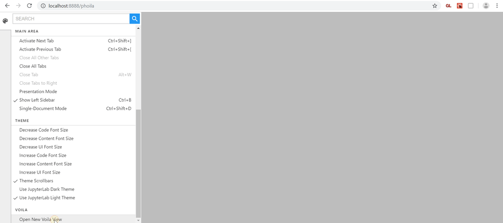

# phoila

[](https://travis-ci.org/vidartf/phoila)
[](https://codecov.io/gh/vidartf/phoila)


A Phosphor wrapper for Voila, hence the name Pho(sphor) + (V)oila.

https://github.com/phosphorjs/phosphor/

https://github.com/Quantstack/voila



## Installation

Install using pip:

```bash
pip install phoila
```

Add any lab extensions you need to phoila:

```bash
phoila install <lab-extension name> [<lab-extension name> ...]
```

(if you don't need any extensions, make sure to run `phoila build` instead)

Then run it:

```bash
phoila
```

## Helpful config options

Since all kernels are one-to-one per dashboard, without any magic to
automatically shut down kernels once the dashboard is closed, it can be
helpful to configure automatic culling, by configuring
`MappingKernelManager.cull_idle_timeout` to a value greater than 0.
This can either be done on invocation `--MappingKernelManager.cull_idle_timeout=300` or in a config file
(`phoila --generate-config`).


## Components

Phoila consists of the following parts:
- An application entry point (`phoila` that points to `phoila.app:main`).
  This starts a server application, with the main handler on
  `<base_url>/phoila`. This page serves a custom JupyterLab/Phosphor app.
  It also adds other JupyterLab handlers to the app.
- Subcommands for the application that install and remove extensions in
  the custom lab app. This includes `phoila install <extension name>`,
  `phoila build`, etc.
- A custom server handler and lab extension for showing Voila templates.
  This includes a custom jupyter-widgets (ipywidgets) manager for rendering widgets. This view differs from the preview extension in Voila in the
  different dashboards aren't rendered in an iframe, so the static assets
  are shared across the different dashboards.
